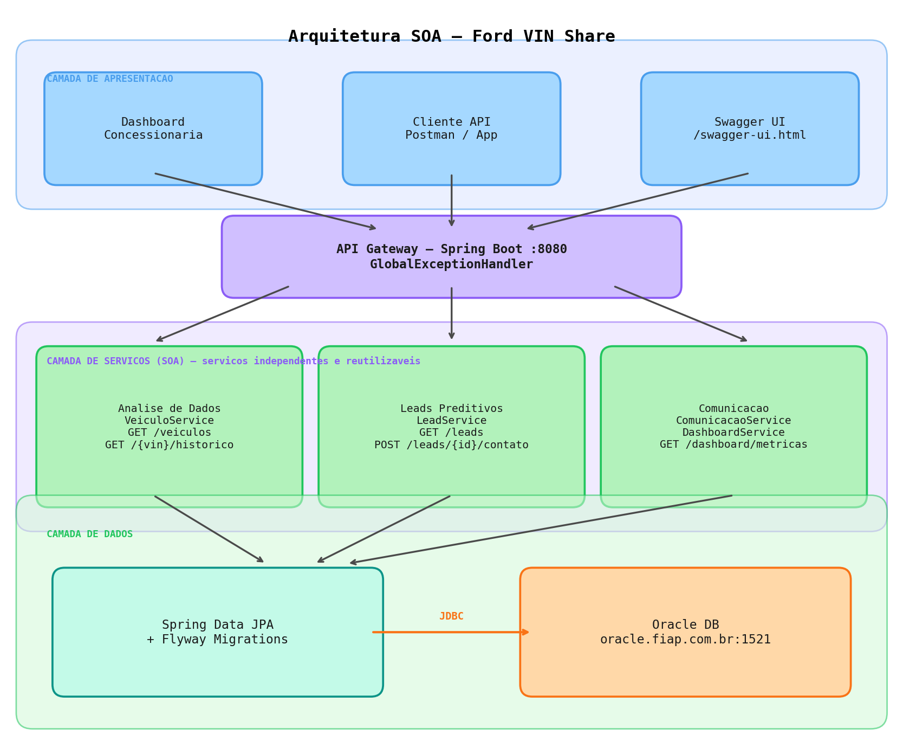

# Ford VIN Share API

> Solução SOA para aumento de retenção de clientes na rede oficial de pós-venda Ford  
> **Challenge FIAP — Desafio 02: Impulsionando o VIN Share na América do Sul**

---

## Integrantes

| Nome | RM |
|---|---|
| Fabiano Zague | 555524 |
| Pedro Certo | 556268 |
| Maria Clara | 557478 |
| Lorran Santos | 558982 |
| Vinicius Matareli | 555200 |

---

## Visão Geral

A API implementa uma arquitetura orientada a serviços (SOA) para identificar veículos Ford com alta probabilidade de precisar de serviço ou risco de sair da rede oficial. As concessionárias acessam o painel para consultar leads preditivos e registrar interações com clientes.

---

## Stack Tecnológica

| Componente | Tecnologia |
|---|---|
| Linguagem | Java 17 |
| Framework | Spring Boot 3.2 |
| Banco de dados | Oracle DB (ojdbc11) |
| ORM | Spring Data JPA / Hibernate |
| Migrações | Flyway |
| Documentação | Swagger / OpenAPI 3 (springdoc) |
| Validação | Jakarta Bean Validation |

---

## Arquitetura SOA

> **Diagrama de arquitetura:** disponível no arquivo `docs/arquitetura-soa.excalidraw`.



O projeto segue separação clara em três camadas independentes:

```
Camada de Apresentação
  └── Dashboard da Concessionária
  └── Cliente API (Postman / App)
  └── Swagger UI (/swagger-ui.html)
          │ HTTP/JSON
Camada de Serviços (SOA)
  └── Serviço de Análise de Dados   → VeiculoService
  └── Serviço de Leads Preditivos   → LeadService
  └── Serviço de Comunicação        → ComunicacaoService + DashboardService
          │ JPA
Camada de Dados
  └── Spring Data JPA + Flyway → Oracle DB
```

Cada serviço é **independente e reutilizável**, sem acoplamento direto entre si.

---

## Pré-requisitos

- Java 17+
- Maven 3.8+
- Oracle Database (local ou XE)

---

## Configuração do Banco de Dados

1. Crie um usuário/schema Oracle:

```sql
CREATE USER vinshare_user IDENTIFIED BY vinshare_pass;
GRANT CONNECT, RESOURCE, CREATE SESSION TO vinshare_user;
GRANT UNLIMITED TABLESPACE TO vinshare_user;
```

2. Edite `src/main/resources/application.properties` substituindo os campos abaixo com as suas credenciais:

```properties
# Substitua pela URL do seu banco Oracle (ex: oracle.fiap.com.br)
spring.datasource.url=jdbc:oracle:thin:@//<SUA_URL_ORACLE>:1521/orcl

# Substitua pelo seu usuário Oracle (ex: RM123456)
spring.datasource.username=<SEU_USUARIO>

# Substitua pela sua senha Oracle
spring.datasource.password=<SUA_SENHA>
```

> As tabelas e dados iniciais serão criados automaticamente pelo **Flyway** na primeira execução.

---

## Como Executar

```bash
# Clonar o repositório
git clone https://github.com/seu-grupo/ford-vinshare-api.git
cd ford-vinshare-api

# Compilar e rodar
./mvnw spring-boot:run
```

A API sobe em `http://localhost:8080`.

---

## Documentação Swagger

Acesse `http://localhost:8080/swagger-ui.html` para explorar e testar todos os endpoints interativamente.

Schema OpenAPI JSON: `http://localhost:8080/api-docs`

---

## Endpoints

### Veículos — Serviço de Análise de Dados

#### `GET /api/v1/veiculos`
Lista todos os veículos cadastrados.

**Response 200:**
```json
{
  "sucesso": true,
  "dados": [
    {
      "id": 1,
      "vin": "9BWZZZ377VT004251",
      "modelo": "Ford Ka",
      "ano": 2021,
      "cor": "Prata",
      "kmAtual": 35000,
      "nomeCliente": "Carlos Andrade",
      "emailCliente": "carlos.andrade@email.com"
    }
  ],
  "timestamp": "2025-05-18T10:30:00"
}
```

---

#### `GET /api/v1/veiculos/{vin}`
Retorna um veículo específico pelo número VIN.

**Parâmetro:** `vin` — número VIN do veículo (17 caracteres)

**Response 200:**
```json
{
  "sucesso": true,
  "dados": {
    "id": 1,
    "vin": "9BWZZZ377VT004251",
    "modelo": "Ford Ka",
    "ano": 2021,
    "cor": "Prata",
    "kmAtual": 35000,
    "nomeCliente": "Carlos Andrade"
  }
}
```

**Response 404:**
```json
{
  "sucesso": false,
  "mensagem": "Recurso não encontrado",
  "erro": "Veículo com VIN '9BWZZZ377VT000000' não encontrado"
}
```

---

#### `GET /api/v1/veiculos/{vin}/historico`
Histórico de manutenções do veículo, ordenado do mais recente.

**Response 200:**
```json
{
  "sucesso": true,
  "dados": [
    {
      "id": 1,
      "dataManutencao": "2024-03-15",
      "tipoServico": "Revisão 30.000 km",
      "valorServico": 650.00,
      "concessionaria": "Ford Itaim Bibi",
      "observacao": "Troca de óleo e filtros"
    }
  ]
}
```

---

### Leads — Serviço de Leads Preditivos

#### `GET /api/v1/leads`
Lista todos os leads preditivos ordenados por score (maior primeiro).

**Query param opcional:** `status` = `NOVO` | `EM_CONTATO` | `CONVERTIDO` | `PERDIDO`

**Exemplo:** `GET /api/v1/leads?status=NOVO`

**Response 200:**
```json
{
  "sucesso": true,
  "dados": [
    {
      "id": 4,
      "scorePropensao": 91.0,
      "status": "NOVO",
      "recomendacaoAcao": "Ação prioritária: veículo novo com alto valor...",
      "vin": "9BWZZZ377VT098765",
      "modeloVeiculo": "Ford Territory",
      "nomeCliente": "Roberto Lima",
      "telefoneCliente": "(21) 99876-5432"
    }
  ]
}
```

---

#### `GET /api/v1/leads/{id}`
Detalhe de um lead específico.

---

#### `POST /api/v1/leads/{id}/contato`
Registra uma interação com o cliente. Atualiza automaticamente o status de `NOVO` para `EM_CONTATO`.

**Request body:**
```json
{
  "observacao": "Cliente contatado por telefone, demonstrou interesse na revisão."
}
```

**Response 200:**
```json
{
  "sucesso": true,
  "mensagem": "Contato registrado com sucesso",
  "dados": {
    "id": 1,
    "status": "EM_CONTATO",
    "dataUltimoContato": "2025-05-18T10:45:00",
    "nomeCliente": "Carlos Andrade"
  }
}
```

---

### Dashboard

#### `GET /api/v1/dashboard/metricas`
Métricas consolidadas de VIN Share para o painel da concessionária.

**Response 200:**
```json
{
  "sucesso": true,
  "dados": {
    "totalVeiculos": 4,
    "totalClientes": 3,
    "totalLeads": 4,
    "leadsNovos": 3,
    "leadsEmContato": 1,
    "leadsConvertidos": 0,
    "leadsPerdidos": 0,
    "taxaRetencao": 0.0,
    "scoremedioLeads": 73.88,
    "totalManutencoesUltimos90Dias": 1
  }
}
```

---

## Tratamento de Erros

Todas as respostas de erro seguem o padrão JSON abaixo — sem exposição de stack trace:

| Código | Situação |
|---|---|
| 200 | Sucesso |
| 400 | Dados inválidos / validação falhou |
| 404 | Recurso não encontrado |
| 500 | Erro interno do servidor |

```json
{
  "sucesso": false,
  "mensagem": "Dados inválidos",
  "erro": "Observação do contato é obrigatória",
  "timestamp": "2025-05-18T10:30:00"
}
```

---

## Migrações Flyway

| Versão | Arquivo | Descrição |
|---|---|---|
| V1 | `V1__create_tables.sql` | Criação de sequences e tabelas Oracle |
| V2 | `V2__seed_data.sql` | Dados iniciais para demonstração |

Flyway executa as migrações automaticamente na inicialização da aplicação.

---

## Estrutura do Projeto

```
ford-vinshare-api/
├── pom.xml
├── README.md
└── src/main/
    ├── java/br/com/ford/vinshare/
    │   ├── FordVinShareApplication.java
    │   ├── config/
    │   │   └── SwaggerConfig.java
    │   ├── controller/
    │   │   ├── VeiculoController.java      ← Serviço de Análise de Dados
    │   │   ├── LeadController.java         ← Serviço de Leads Preditivos
    │   │   └── DashboardController.java
    │   ├── service/
    │   │   ├── VeiculoService.java
    │   │   ├── LeadService.java
    │   │   ├── ComunicacaoService.java     ← Serviço de Comunicação
    │   │   └── DashboardService.java
    │   ├── repository/
    │   │   ├── ClienteRepository.java
    │   │   ├── VeiculoRepository.java
    │   │   ├── HistoricoManutencaoRepository.java
    │   │   └── LeadRepository.java
    │   ├── model/
    │   │   ├── Cliente.java
    │   │   ├── Veiculo.java
    │   │   ├── HistoricoManutencao.java
    │   │   └── Lead.java
    │   ├── dto/
    │   │   ├── ApiResponse.java
    │   │   ├── VeiculoDTO.java
    │   │   ├── HistoricoManutencaoDTO.java
    │   │   ├── LeadDTO.java
    │   │   ├── ContatoRequestDTO.java
    │   │   └── DashboardMetricasDTO.java
    │   └── exception/
    │       ├── RecursoNaoEncontradoException.java
    │       └── GlobalExceptionHandler.java
    └── resources/
        ├── application.properties
        └── db/migration/
            ├── V1__create_tables.sql
            └── V2__seed_data.sql
```
